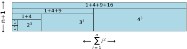
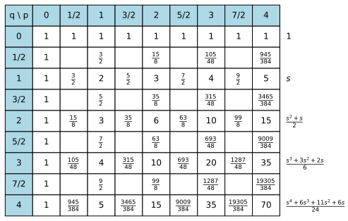
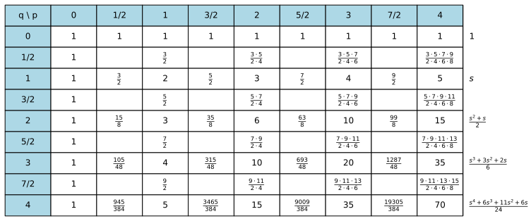

# Chapter 1: Brief History

Definition:
-----------

Calculus, originally called infinitesimal calculus, is a mathematical discipline focused on limits, continuity, derivatives, integrals, and infinite series. 

Before Calculus
---------------

Before Calculus even existed, people deal with infinite problems with **Method of Exhaustion** which is basically using the idea of **convergent infinite sequence**. The classic issue is finding the area of a circle by Archimedes. Archimedes used the Method of Exhaustion to approximate the area of a circle by inscribing and circumscribing polygons with an increasing number of sides within the circle. By calculating the area of these polygons, Archimedes was able to create upper and lower bounds for the area of the circle. As the number of sides of the polygons increased, these bounds converged to the exact area, ultimately leading him to deduce that the area of a circle is $\pi r^{2}$.

After the decline of ancient Greek civilization, Europe entered the Dark Ages. The spark of Greek civilization was preserved and studied by the Arabs. Alhazen (965 AD - 1039 AD) was an outstanding mathematician and physicist of the ancient Arab era. He delved into a vast array of ancient Greek mathematics, including infinite sequences and series, as well as the summation of powers of natural numbers. By combining geometry and algebra, he successfully derived and explained the summation formulas of powers of natural numbers in an intuitive geometric manner. 

Let's first consider the summation $\sum_{i=1}^{n}{i^k}$ where k is only for natural number. When the k=1, the summation is $1+2+3+4+...$, Alhazen invoke geometry area to imagine and calculate the algebraic summation like below: 

<p align="center">
  
</p>

Figure_1

As you can see That the total area is

```math
n(n+1) = \sum_{i=1}^{n}{i} + \sum_{i=1}^{n}{i} 
```

and so 

```math
\sum_{i=1}^{n}{i} = {n(n+1) \over 2} = {1 \over 2}n^2 + {1 \over 2}n
```

let's move on and take $k=2$, the image is like below

<p align="center">
  
</p>

Figure_2


The total area is

```math
\left( \sum_{i=1}^{n}{i} \right) \left( n+1 \right) = \sum_{i=1}^{n}{i^2} + \sum_{i=1}^{n}{ \left( \sum_{k=1}^{i}{k} \right) }
```

And we want to find $\sum_{i=1}^{n}{i^2}$, so we can do

```math
\left( {1 \over 2} n^2 + {1 \over 2} n \right) \left( n+1 \right) = \sum_{i=1}^{n}{i^2} + \sum_{i=1}^{n}{ \left( {1 \over 2} i^2 + {1 \over 2} i \right) }
```
```math
{1 \over 2} n^3 + n^2 + {1 \over 2} n = \sum_{i=1}^{n}{i^2} + {1 \over 2} \sum_{i=1}^{n}{i^2} + {1 \over 2} \left( {1 \over 2} n^2 + {1 \over 2} n \right)
```
```math
{1 \over 2} n^3 + {3 \over 4} n^2 + {1 \over 4} n = {3 \over 2} \sum_{i=1}^{n}{i^2}
```

and so

```math
\sum_{i=1}^{n}{i^2} = {1 \over 3} n^3 + {1 \over 2} n^2 + {1 \over 6} n

```

let's move on and take $k=3$, the image is like below

<p align="center">
  
</p>

Figure_3


At this point, we can find the pattern, and the total area is

```math
\left( \sum_{i=1}^{n}{i^2} \right) { \left( n+1 \right) } = \sum_{i=1}^{n} \left( \sum_{k=1}^{i}{k^2} \right)
```

We want to find $\sum_{i=1}^{n}{i^3}$, and so do

```math
\left( {1 \over 3} n^3 + {1 \over 2} n^2 + {1 \over 6} n \right) \left( n+1 \right) = \sum_{i=1}^{n}{i^3} + \sum_{i=1}^{n}{\left( {1 \over 3} i^3 + {1 \over 2} i^2 + {1 \over 6}i \right) }
```
```math
{1 \over 3}n^4+{5 \over 6}n^3+{4 \over 6}n^2+{1 \over 6}n = \sum_{i=1}^{n}{i^3} + {1 \over 3} \sum_{i=1}^{n}{i^3} + {1 \over 2} \left( {1 \over 3}n^3 + {1 \over 2}n^2 + {1 \over 6}n \right) + {1 \over 6} \left( {1 \over 2}n^2 + {1 \over 2}n \right)
```
```math
{1 \over 3}n^4 + {4 \over 6}n^3 + {4 \over 12}n^2 = {4 \over 3} \sum_{i=1}^{n}{i^3}
```

And so

```math
\sum_{i=1}^{n}{i^3} = {1 \over 4}n^4 + {1 \over 2}n^3 + {1 \over 4}n^2
```

The summation of $k=4, 5, 6...$ is using the same idea. There's an obvious pattern if we list all the summations below

```math
\sum_{i=1}^{n}{i} = {1 \over 2}n^2 + {1 \over 2}n
```
```math
\sum_{i=1}^{n}{i^2} = {1 \over 3} n^3 + {1 \over 2} n^2 + {1 \over 6} n

```
```math
\sum_{i=1}^{n}{i^3} = {1 \over 4}n^4 + {1 \over 2}n^3 + {1 \over 4}n^2
```
```math
\sum_{i=1}^{n}{i^4} = {1 \over 5}n^5 + {1 \over 2}n^4 + {1 \over 3}n^3 - {1 \over 30}n
```
```math
\text{...}
```

The empirical pattern reveals that the coefficient of first term(the highest power term) of those summations are always ${1 \over (k+1)}$. By the way, since we use "geometric" perspective to visualize the summation of integer power, there's another intuitive way to imagine the summation
  * For $k=1$, we are actually adding up the area of $1 \cdot n$ 2 dimensional rectangle.

<p align="center">
  
  <span style="background-color: grey; color: white; padding: 2px 5px;">Figure_4</span>
</p>

Figure_4


  * For $k=2$, we are actually adding up the volume of $1 \cdot n^2$ 3 dimensional volumes

<p align="center">
  
</p>

Figure_5


  * For $k=3$, we are actually adding up the $1 \cdot n^3$ 4 dimension hypervolume.(Not possible to draw)

Time flies, and in the blink of an eye, 6 hundred years have passed. In 1656, during the late Renaissance, John Wallis, an important professor of mathematics and physics at the University of Oxford in England, referred to Alhazen's research and made many extensions.

First, he used Cartesian coordinates to reformulate the geometric description of the sum of natural numbers raised to k-th power. He transfomed $\sum_{i=1}^{n}{i^k}$ into $y=x^k$. When n becomes sufficiently large, the area under the curve $y=x^k$ should closely approximates the sum $\sum_{i=1}^{n}{i^k}$.

It should be stressed here that results about areas and volumes were not given as
formulas but always as ratios. This is true about nearly all such mathematical results
until the end of the seventeenth century. For example the area of a triangle is one half
of the area of the parallelogram that contains it. The volume of a pyramid is one third
of the box that contains it. The area of a piece of a parabola is two thirds of the
rectangle that contains it. The area of the circle is π/4 of the square that contains it.
These examples were all known by the second century BC. Alhazen and Wallis's works followed the same tradition, but within a new way.


<p align="center">
  
</p>

Figure_6

As Figure_6 shows, Wallis He selected a point on the curve $y=x^k$. The area of the rectangle which is defined as 1 formed by this point and the x- and y-axes, to the area under the curve and enclosed by the x- and y-axes.

If we cut the area under the curve into pieces of infinite small line segments, the summation of all the segments should follows the Alhazen's result too because there are infinite large terms. We've already known the result of Alhazen's summation $\sum_{i=1}^{n}{i^k}$. When $n$ is large enough, the summation should be lead by the first term which is ${1 \over (k+1)}$. So, obviously, when the area of rectangle is defined by 1, the ratio $\rho = {1 \over (1+k)}$ when n is large enough.

This is true for every **integer** point on the curve we choose, you can easily prove that. 

Wallis keeped move on, he tried to figure out if $\rho = {1 \over (1+k)}$ still keeps true when $k$ is not just integer but all real number.

First, He knew that when $k={1 \over 2}, {1 \over 3}, {1 \over 4}...$ then $\rho={1 \over (k+1)}$ keeps true. Because, for example $y = x^{1 \over 2}$ is just complementary to $y = x^2$. Actually if we rewrite $y=x^2$ as $y^{1 \over 2}=x$, then thing would be clear like the Figure_7 shows below. 

<p align="center">
  
</p>

Figure_7

The area cover by $y^{1 \over k}=x$ should be 
```math
1-{1 \over {k+1}} = {1 \over {{1 \over k}+1}}
```

Wallis doesn't prove that $\rho={1 \over {k+1}}$ remains true for any real number $k$. He only provide the reasoning for inverse integers $1 \over k$ like above and then doing some empirical tests for some real number $k$ to be more confident to believe that the pattern can be used in every real number $k$. (However, I think the idea of "continuity" may work to provide a proof.) 

One of the tests is finding the ratio of area under the curve of a circle curve which is $y=\sqrt{r^2-x^2}$ in first quadrant of cartesian coordinates. 

<p align="center">
  
</p>

Figure_8

Of course, Wallis knew that the ratio is $\pi \over 4$, he wanted to check if his theory(or in modern sense, a hypothesis) is correct in this case. However, $y=\sqrt{r^2-x^2}=(r^2-x^2)^{1 \over 2}$ is can't be directly expand because he knew nothing about any of **general binomial theorem** to expand fraction power like $(a+b)^{1 \over 2}$. So, he use his so called **interpolation** theorem to guess the answer.

First he defined the general form $y=\left( r^{1 \over q} + x^{1 \over q} \right)^p$. And find all the ration when p and q are integers number. You can expand the expression and use the theory $\rho={1 \over (k+1)}$ to do that. Eventually, you would get the table like Figure_9 below

<p align="center">
  
</p>

Figure_9


At this point Wallis temporarily abandoned both the geometric and algebraic representations and began to work solely in the table representation. The question then became, how does one interpolate the missing values in this table? His interpolate idea is based on that he trust the same pattern a row has should be follow by the missing value on that row. Figure_10 is the pattern he found:

<p align="center">
  
</p>

Figure_10


Expand the fraction numbers, we get the result of Figure_11

<p align="center">
  
</p>

Figure_11

Now if we denote the ratio when $p={1 \over 2}$ and $q={1 \over 2}$ as $\Omega$, a reasonable pattern should be as Figure_12 shows below:

<p align="center">
  
</p>

Figure_12


[binomial theorem proof](https://math.stackexchange.com/questions/1010877/binomial-theorem-proof-for-rational-index-without-calculus)

Hundreds of years are gone. In 1656, , John Wallis published his Arithemtica infinitorum, in which he displayed many ideas that were to lead to the integral calculus of Newton, including the famous **Wallis Product** which gives below (check 
[reference1: a paper talks about this](https://www.jstor.org/stable/25759727?seq=1) 
[reference2: Mathematitcal_Intention_Wallis, another paper talks about this](https://www.quadrivium.info/GGB/WallisTable.html) 
[reference3: a discussion talk about the prove of generalized binomial theorem](https://www.reddit.com/r/math/comments/8vv21s/how_do_you_prove_the_binomial_theorem_for_all/)

```math
{2 \over \pi} = {{1 \cdot 3} \over {2 \cdot 2}} \cdot {{3 \cdot 5} \over {4 \cdot 4}} \cdot {{5 \cdot 7} \over {6 \cdot 6}} \cdot...
```

Earlier in 1593, Vieta found another infinite product which gives $\pi$

```math
{2 \over \pi} = \sqrt{1 \over 2} \cdot \sqrt{{1 \over 2}+{1 \over 2} \cdot \sqrt{1 \over 2}} \cdot \sqrt{{1 \over 2}+{1 \over 2} \cdot {\sqrt{{1 \over 2}+{1 \over 2} \cdot \sqrt{1 \over 2}}}}... 
```

But, since Wallis doesn't mention it, we suppose that he was unaware of it.(Remarkably, these two seemingly different products are special cases of a more general formula (3).) The thoughts that lead Wallis to (1) are quite surprising and ingeious. It is the purpose of this paper to show to modern readers the brilliance of Wallis' thinking in his disocvery of (1)

How Calculus created?
---------------------

One thing to keep in mind is that Calculus is nothing more than an updated version of the Method of Exhuastion, but now it specifically deal with **Functions**. People have played algebra, geometry, and arithmetic for a long time. In 17th centuries, science was born and started to join the game. Many math problems were being researched again, like finding area of a shape, finding the length of curve or volume of some solid body. Most of them were written in algebraic expressions and equations. So a problem may like this in that time: How do we computer the area under a unit circle curve which is express as $\sqrt{1-x^2}$ under first quadrant of cartesian coordinates? We can use the Method of Exhaustion, take n number of small rectangles under the curve, and when n increases the more accurate the area we computer.   The term "Function" is created by Lebniz in 1694
